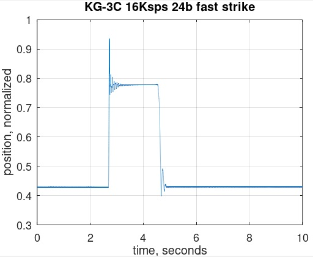
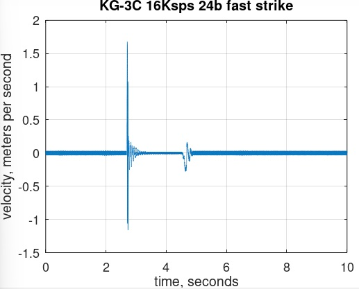
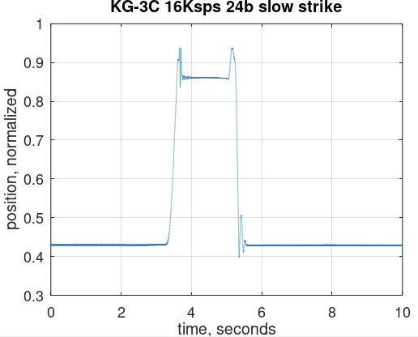
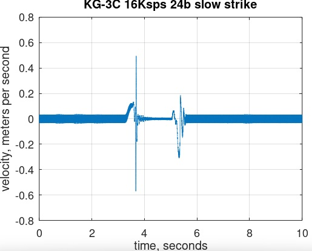

# Kawai KG-3C Data

## Data Source

Samples are from a Kawai KG-3C action.

These samples are the motion of the hammer shank at a point close to the flange.

All samples are for middle A key strikes (A4).

Data is for fast and slow strikes and at sample rates of 2Ksps, 8Ksps, 16Ksps
(Ksps = thousands of samples per second).

Each data file was generated by a separate manual key strike.
Therefore, the 'fastness' of fast and the 'slowness' of slow is
not consistent between data sets.

## Measurement System

Sampled with a Texas Instruments ADS131M08 analog to digital converter.
All data is 24-bit. Only using positive voltage so upper bit is always zero.

Sensor is a CNY-70. The hammer motion in files is a combination of the actual
hammer motion plus nonlinearities of sensor. This may be the cause of unusual
behavior near hammer strike in the data?

See DIY-Grand-Digital-Piano repository for further details of measurement system.

https://github.com/gzweigle/DIY-Grand-Digital-Piano

https://github.com/gzweigle/DIY-Grand-Digital-Piano/blob/main/video_documentation.md

## Data Usage

Each .txt file contains a single column of hammer samples taken over 10 seconds.

The timestamp of each file row is based on the sample rate.  For example, at 2Ksps
each row increments by 1/2000 = 500 microseconds.

The data is raw analog to digital converter samples. The maximum value is
2^24 = 16777216.  The minimum value is 0.

The data can be opened in Excel.

To use the .m file in this directory:
1. Install Octave or Matlab.
2. Type:
   plot_data_and_velocity
   in the command window of Octave or Matlab.

## Plots

Here are the 16Ksps plots generated by plot_data_and_velocity.m

