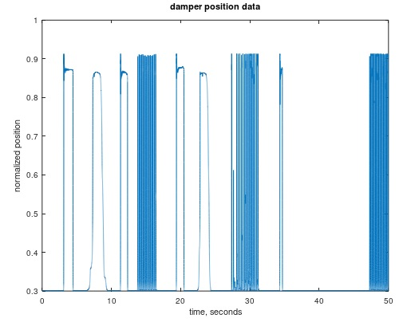

# Kawai KG-3C Damper Data

## Data Source

Samples are from a Kawai KG-3C action.

These samples are the position of the back of the key, where damper rail is positioned.

All samples are for middle-E key strikes (E4).

Data is for fast and slow strikes and at a sample rate of 2Ksps
(Ksps = thousands of samples per second).

Data is for slow, fast and repeated key strikes.

The fastest release is by quickly sliding my finger off the edge of the key so that the
key returned to its default position entirely on its own.

## Measurement System

17 bits of ADC data.

Sensor is a CNY-70. The hammer position in files is a combination of the actual
key position plus nonlinearities of sensor.

See DIY-Grand-Digital-Piano repository for further details of measurement system.

https://github.com/gzweigle/DIY-Grand-Digital-Piano

https://github.com/gzweigle/DIY-Grand-Digital-Piano/blob/main/video_documentation.md

## Data Usage

The .txt file contains a single column of key position samples taken over 50 seconds.

The timestamp of each file row is based on the sample rate.  For example, at 2Ksps
each row increments by 1/2000 = 500 microseconds.

The data is normalized analog to digital converter samples [0.0, ..., 1.0].

The data can be opened in Excel.

To use the .m file in this directory:
1. Install Octave or Matlab.
2. Type:
   plot_data_and_velocity
   in the command window of Octave or Matlab.

## Plots

