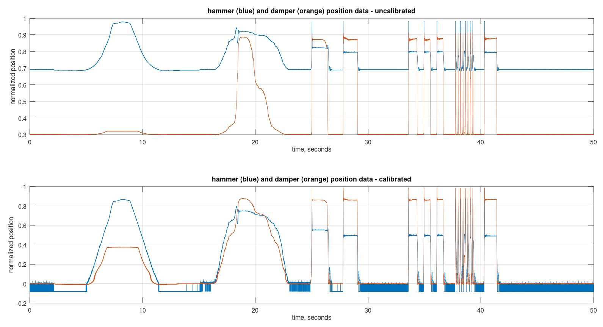
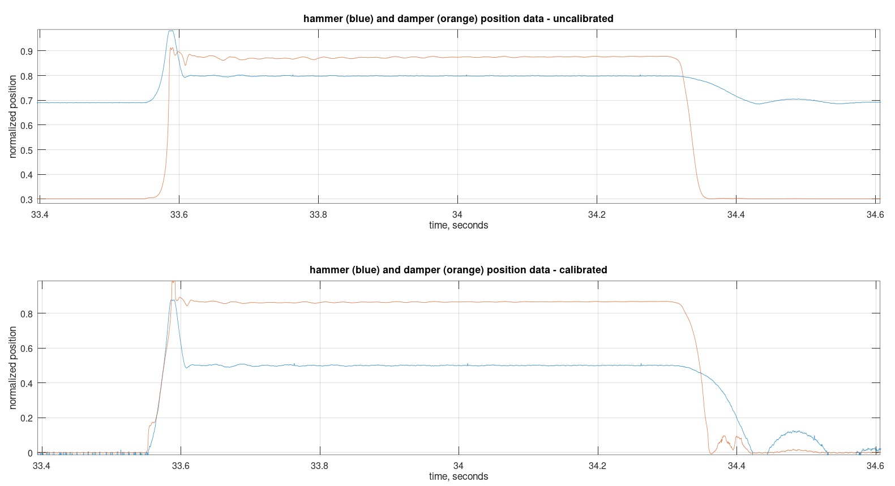
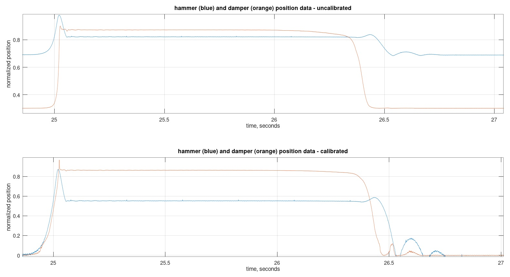
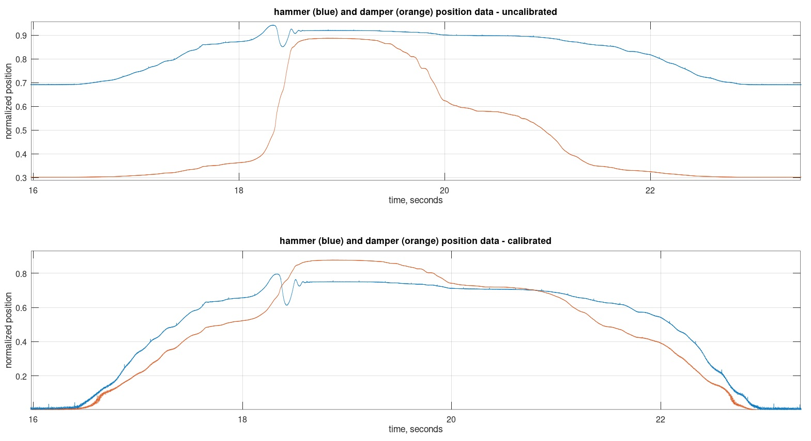

# Kawai KG-3C Hammer and Damper Data

## Data Source

Samples are from a Kawai KG-3C action.
All samples are for middle-E key strikes (E4).

Damper measurements are at back of the key, where damper rail is positioned.
Hammer samples are at the front of the shank.

The damper measurement location travels 1/2".
The hammer measurement location travels 5/32".

## Action Dynamics in .txt File

1. Slowly moving the hammer only. Due to action mechanism, the key also moves.
2. Very slow keypress and release.
3. Medium speed keystrike.
4. Fast strike then let finger slide off front of key quickly.
5. Single fast keypresses.
6. Single fast keypresses.
7. Single fast keypresses.
8. Repeated keystrike.
9. Repeated keystrike.
10. Repeated keystrike.
11. Repeated keystrike.
12. Repeated keystrike.
13. Repeated keystrike.
14. Repeated keystrike.
15. Repeated keystrike.
16. Fast strike then let finger slide off front of key quickly.

## Measurement System

Sensor is a CNY-70. The measured position data in files are a combination of the actual
key position plus nonlinearities of sensor.

The CNY-70 is mounted on a Hammer Position Sensor (HPS) circuit board.

The damper HPS is with R2=5600 and output ranges [0, 3.3V].

The hammer HPS is with R2=2200 and output ranges [0, 1.2V].

The sensor output is sampled with 17 bits and at a sample rate of 2Ksps
(Ksps = thousands of samples per second).

The ADC accepts [0, 3.3V].

The ADC values are normalized to [0, 1] and then transmitted over Ethernet
to a computer. A short python program (not included in this directory)
receives the data and stores into a .txt file.

See DIY-Grand-Digital-Piano repository and YouTube channel for further
details of measurement system.

https://github.com/gzweigle/DIY-Grand-Digital-Piano

https://github.com/gzweigle/DIY-Grand-Digital-Piano/blob/main/video_documentation.md

## Data Usage

The .txt file contains two columns of key position samples taken over 50 seconds.

The timestamp of each file row is based on the sample rate. For example, at 2Ksps
each row increments by 1/2000 = 500 microseconds.

The data is normalized analog to digital converter samples [0.0, ..., 1.0].

The data can be opened in Excel.

To use the .m file in this directory:
1. Install Octave or Matlab.
2. Type:
   plot_hammer_and_damper_data.m
   in the command window of Octave or Matlab.

## Calibration

The two sensors are measuring physical objects that are traveling two different
distances. Therefore, the CNY-70 nonlinearity is different and therefore the
data must be calibrated before comparing.

For damper calibration, I used a ruler with 1/32" increments placed at the front
of the key. I moved the key by 1/32", waited a few seconds, moved they key another
1/32", waited a few seconds, etc. Then, using the resulting measured values, I
created the array damper_cal_points[] in plot_hammer_and_damper.m.

For hammer calibration, I used a thin paper ruler with 1/64" increments and
taped it next to the CNY-70, adjacent to the location of light sending emitter on
the CNY-70. I moved the hammer (not the piano key) by 1/64", waited a few
seconds, etc. Same process as for the damper measurements. The result is
hammer_cal_points[] in plot_hammer_and_damper.m

Note that the damper moves nearly vertically, while the shank moves at an angle.

The file plot_hammer_and_damper.m curve-fits to these calibration points.
Then, inverts the fit in an attempt to undo the CNY-70 nonlinearities.

As a verification, I reran the calibration process, except using the calibration
algorithm before plotting the data. Then, verified that the resulting steps
are approximately linear.

## Plots

The file plot_hammer_and_damper_data.m will generate signal plots.

Both calibrated and uncalibrated results are plotted.

The uncalibrated data is useful to qualitatively validate that the calibrated
data looks reasonable.

The calibrated data is useful for directly comparing the hammer and damper data
when not near the minimum and maximum values. The calibrated data has artifacts
near zero that are not present in the uncalibrated data.
The curve fit to the calibration data is less accurate at the end points.

Here are jpg of the results generated by plot_hammer_and_damper.m

All data in .txt file:

Zoom to a fast piano key press:

Zoom to the medium speed piano key press:

Zoom to the very slow speed piano key press:
