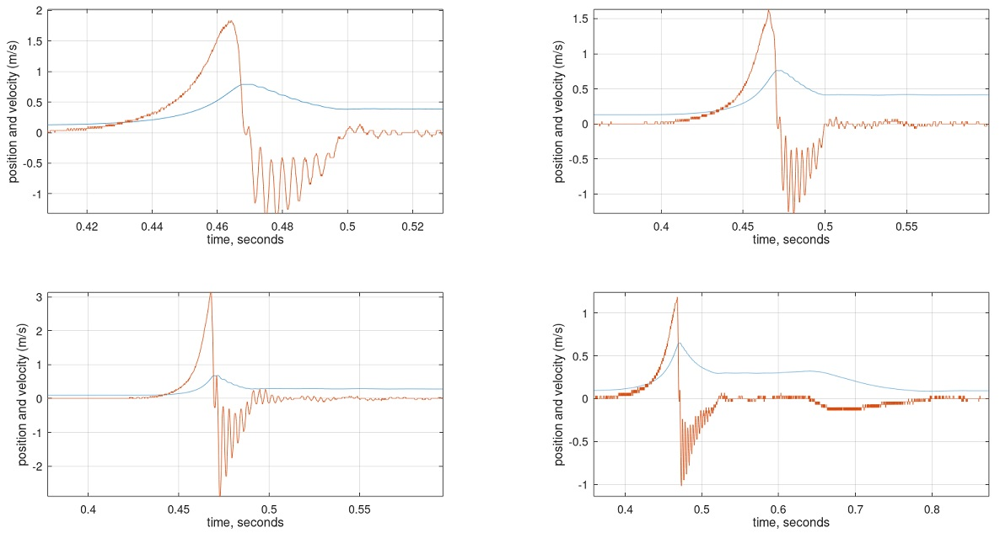
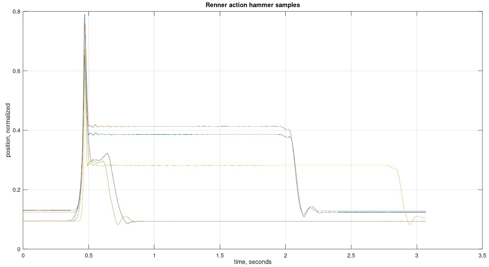

# Renner Action Data

## Data Source

The data contains position samples of 5 hammer strikes for a Renner action.
The data is located in a file called samples.txt.

Samples are the position of the hammer shank at a point close to the flange.

Keys are in the 4th octave but I don't recall which keys were struck to create the data.
This is older data, without as good record keeping as other data in this repository.

## Measurement System

The analog to digital converter is 24-bit.
However, data was post-quantized due to an implementation constraint.
Data was sampled at 8000 samples per second.

Sensor is a CNY-70. The hammer positions in samples.txt is a combination of the actual
hammer position plus nonlinearities of sensor. This may be the cause of unusual
behavior near hammer strikes in the data.

See DIY-Grand-Digital-Piano repository for further details.

https://github.com/gzweigle/DIY-Grand-Digital-Piano

https://github.com/gzweigle/DIY-Grand-Digital-Piano/blob/main/video_documentation.md

## Data Usage

There are five columns of data in samples.txt.
Each column is for a single hammer strike.

To open with Excel, check the box for comma delimited
when importing the data. The data does not have a header row.

To get started with Matlab or Octave, run the file plot_data_and_velocity.m

Data is normalized to 1.0 as max ADC range.
Variation in amplitude is due to non-uniform sensor placement.

## Plots

